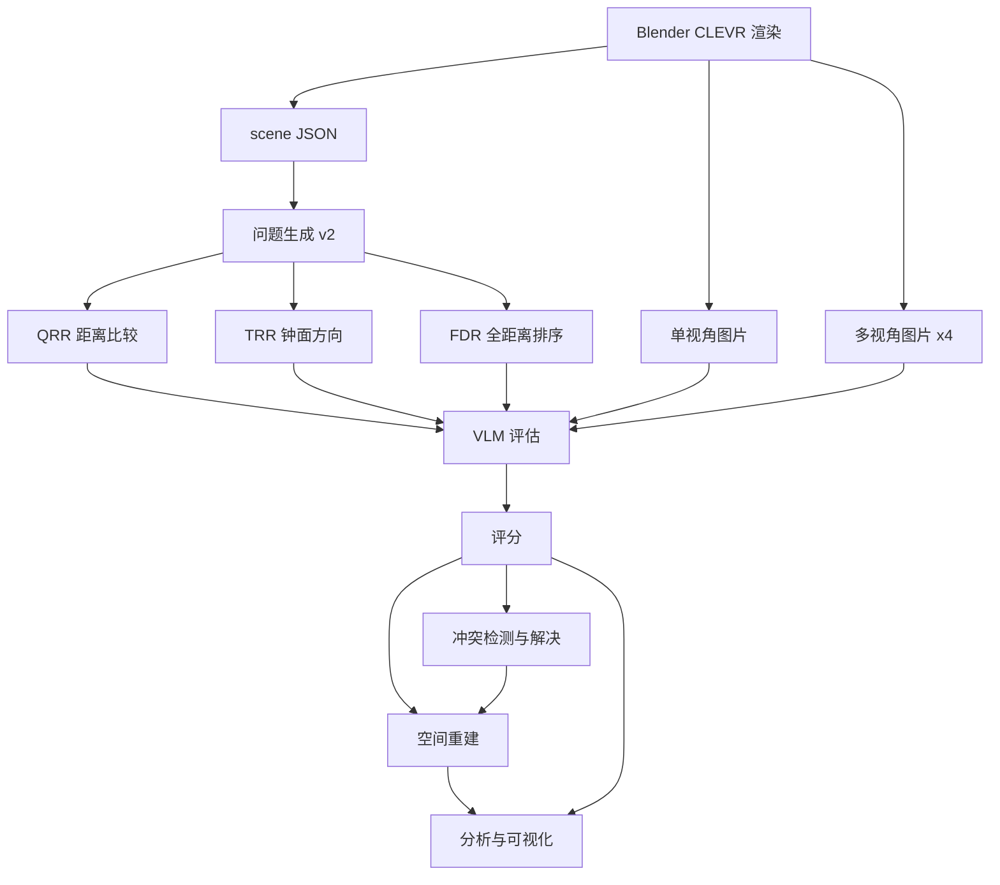
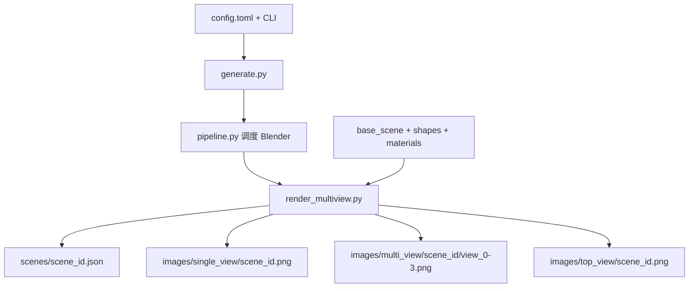
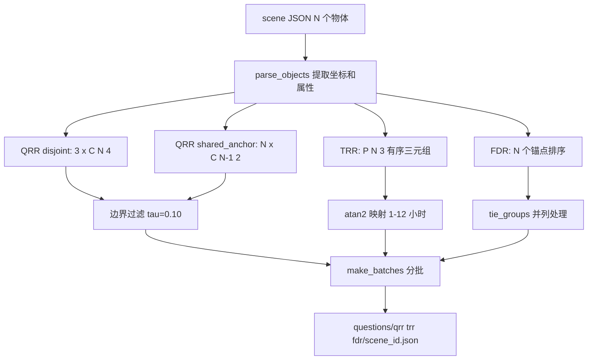
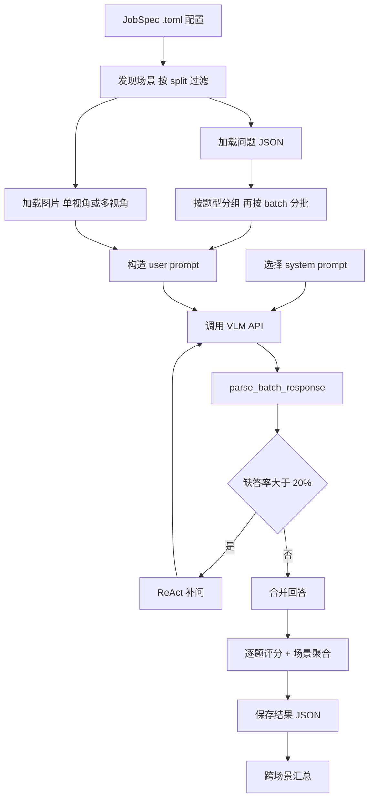
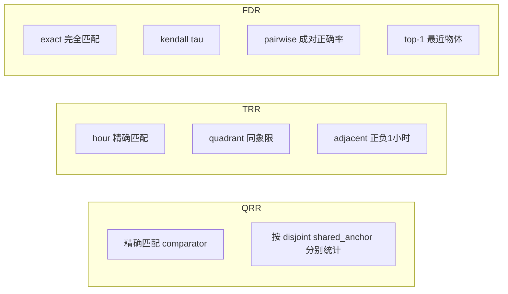
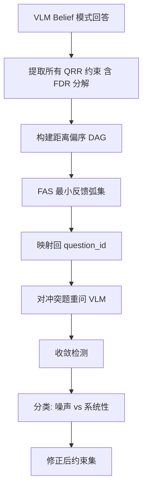
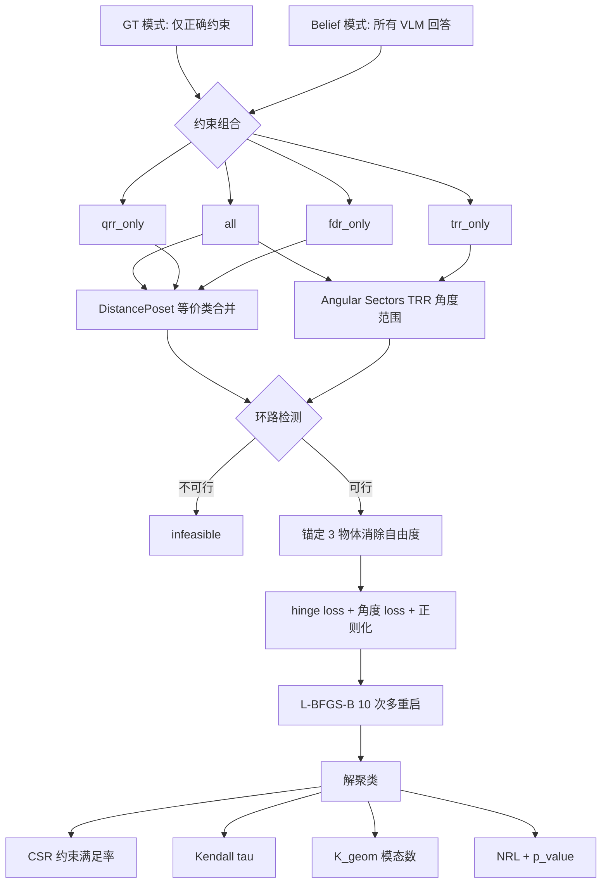
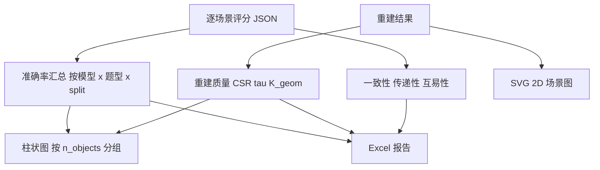
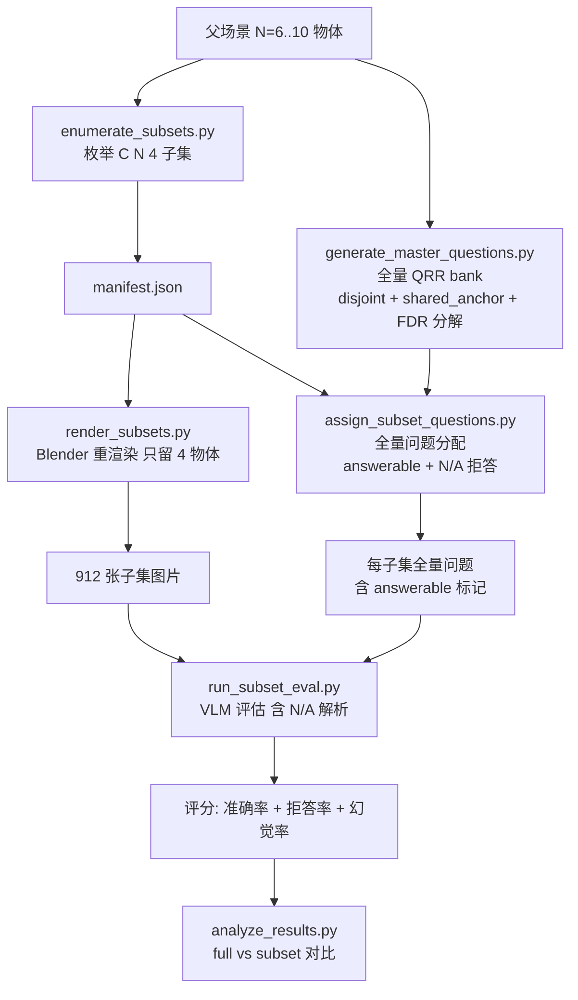
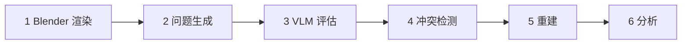

# ORDINARY-BENCH 完整管线总览

## 一、全局管线概览



---

## 二、Blender CLEVR 数据生成



**配置优先级**: 默认值 < config.toml < --preset < CLI 参数

**Splits**: n04 / n05 / n06 / n07 / n08 / n09 / n10 (每个 split 固定物体数)

---

## 三、问题生成



**N=10 规模**: QRR 约 990 题 + TRR 720 题 + FDR 10 题 = 约 1720 题/场景

---

## 四、VLM 评估



**Provider 支持**: OpenAI / OpenRouter / Gemini / DashScope / Mock

---

## 五、评分体系



---

## 六、冲突检测与解决



---

## 七、空间重建



---

## 八、分析与输出



---

## 九、子集图片消融实验

> 核心问题: VLM 是否受图中无关物体干扰? 能否识别不存在的物体并拒答?



---

## 十、端到端执行路径



| 阶段 | 入口脚本 | 输入 | 输出 |
|------|---------|------|------|
| 1 渲染 | data-gen/generate.py | config.toml | scenes/ images/ |
| 2 问题 | VLM-test/generate_questions_v2.py | scenes/ | questions/qrr,trr,fdr/ |
| 3 评估 | VLM-test/API-test/run_eval.py | questions/ images/ | results/ |
| 4 冲突 | VLM-test/run_conflict_resolution.py | results/ | 修正约束 |
| 5 重建 | VLM-test/reconstruct/pipeline.py | 约束集 | positions, metrics |
| 6 分析 | VLM-test/analysis/run_analysis.py | results/ metrics/ | Excel, SVG |

---

## 附: 关键目录结构

```
ordinary-bench-core/
├── data-gen/                     # CLEVR Blender 渲染后端
│   ├── generate.py               #   入口
│   ├── pipeline.py               #   Blender 子进程调度
│   └── blender/                  #   Blender 脚本和资产
├── datasets/test-data/           # 140 场景测试集
│   ├── scenes/                   #   场景 JSON
│   ├── images/single_view/       #   单视角图片
│   └── questions/{qrr,trr,fdr}/  #   按题型分目录
├── VLM-test/
│   ├── dsl/                      # 空间推理 DSL
│   ├── question_bank.py          # 问题枚举
│   ├── extraction.py             # 场景解析
│   ├── generate_questions_v2.py  # 问题生成入口
│   ├── API-test/
│   │   ├── run_eval.py           # 评估入口
│   │   ├── eval_engine.py        # 批量调用 + ReAct
│   │   ├── providers/            # VLM 适配器
│   │   ├── scoring.py            # 评分
│   │   └── jobs/*.toml           # 任务配置
│   ├── reconstruct/
│   │   ├── pipeline.py           # 重建入口
│   │   ├── constraints.py        # DAG + 扇区
│   │   ├── solver.py             # L-BFGS-B
│   │   └── evaluate.py           # CSR tau K_geom
│   ├── conflict_resolution/      # 冲突检测与解决
│   └── analysis/                 # 分析与可视化
└── docs/                         # 文档
```
